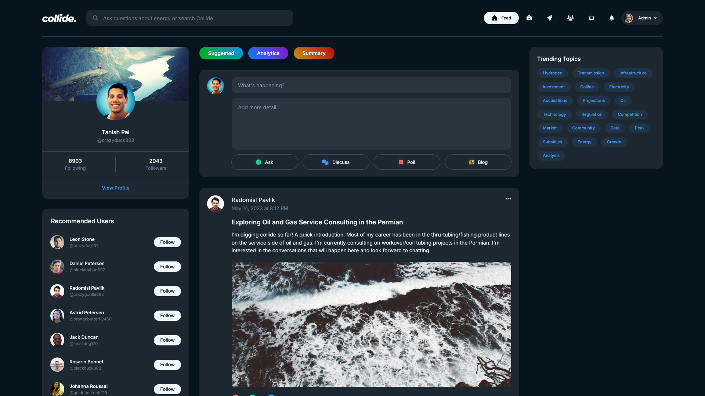
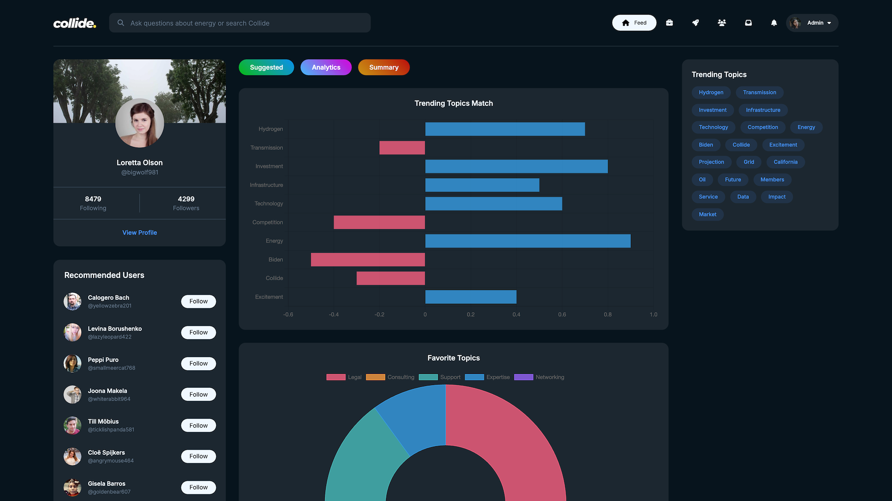

<hr>

# Collide Content Recommendation Engine

### About

This project was created for the [2024 Collide Hackathon](https://lu.ma/bj69zi5z?tk=1greLq) hosted by [Digital Wildcatters](https://digitalwildcatters.com). Not only did we win **1st place**, but we also won the **Most Creative** and **Best UI/UX** awards, and our team was awarded **$1,750** in prize money!

- View our Devpost submission [here](https://devpost.com/software/collide-content-recommendation-engine?ref_content=user-portfolio&ref_feature=in_progress).
- See our project presentation and demo [here](#). [TODO]

### Chosen Prompt

#### Prompt 1a

> ​Create a content ranking engine for Collide. Data includes posts, comments, fake user profiles.

#### Prompt Explanation

Users on [Collide](https://collide.io) need recommendations. The for this challenege is to **create a recommendation engine** that shows a user posts and content tailored to their role and interests.

- Use the data from the user profiles, comments, likes/dislikes table to create a a summary statement about the user.
- We can use this to add context to a system prompts in Collide.
- Follow recommendations based on location/interests/engagement.
- This will be a discovery mechanism for Collide.

### Screenshots





### Technologies Used

#### Frontend

 

#### Backend

 

#### Database


### Hosting Locally

> [!IMPORTANT]
> Ensure sure both `source/client/example.env` and `source/server/example.env` are renamed to `.env` and are properly configured before hosting locally.

#### Starting The Client

```bash
cd source/client # If not already in the client directory.
npm i -y         # Install dependencies.
npm start        # Start the client.
```

#### Starting The Server

```bash
cd source/server                # If not already in the server directory.
pip install -r requirements.txt # Install dependencies.
python3 app.py                  # Start the server.
```

### Future Plans

- Optimize loading speeds on the client by using memoization.
- Add a skeleton loading animation while the content is being fetched.
